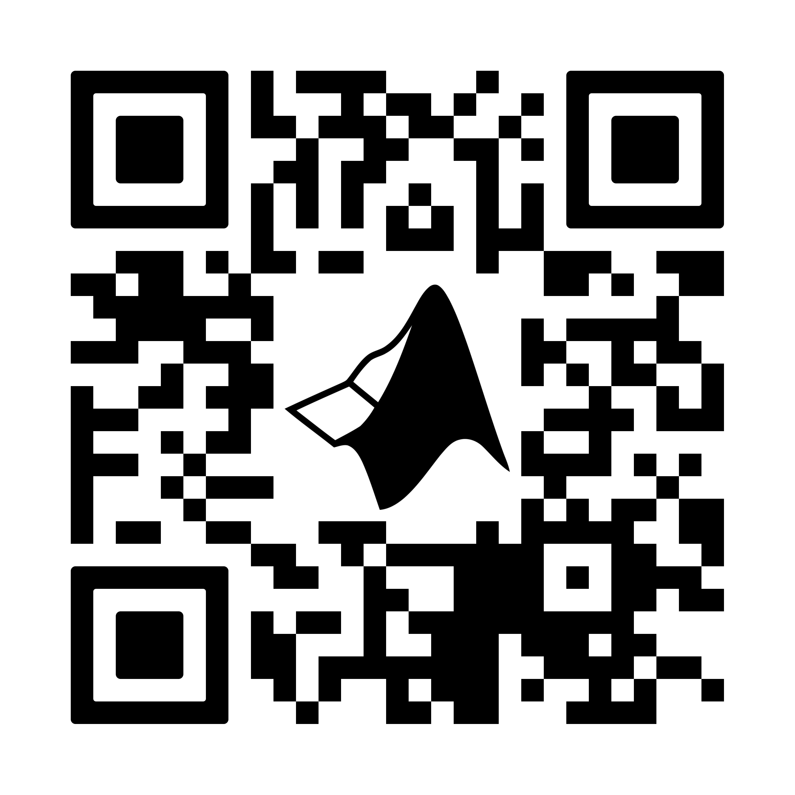

# MATLAB@NYU Official Website
##### by Christopher Lanuza

## Coming Soon:
* Signal Processing Webinar With Professor Eric Tarr:
  * Date: April 10th, 2024
  * Time: 4:00 PM - 5:30 PM EST
  * Platform: Webex
  * Register using the QR code below:

  

[Register Here](https://mathworksmeeting.webex.com/webappng/sites/mathworksmeeting/meeting/register/3a6ce58438b64a1791a0bd39739aa5b7?ticket=4832534b00000007f92bd4ebbc32ba06d23da88af27c1a3992b8fabb00f6c1c059a9b0548f93259c&timestamp=1742871275717&RGID=rd31b809cd850a68a97050e347a83f23f&isAutoPopRegisterForm=false)
